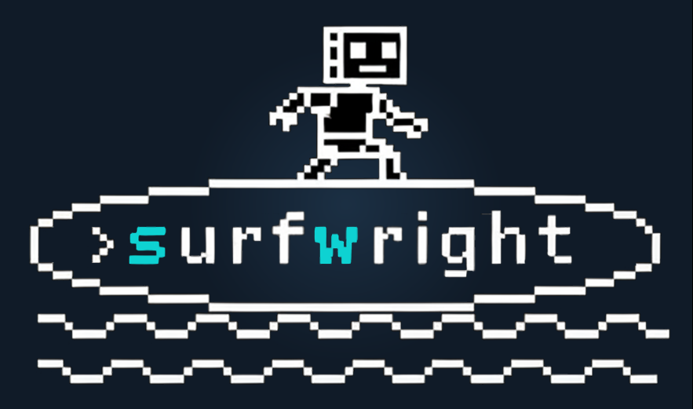

# SurfWright

<p align="left">
  <a href="https://github.com/marcohefti/surfwright/releases"></a>
  <a href="https://github.com/marcohefti/surfwright/actions/workflows/ci.yml"></a>
  <a href="https://www.npmjs.com/package/@marcohefti/surfwright"></a>
  <a href="https://www.npmjs.com/package/@marcohefti/surfwright"></a>
  <a href="#cli-install-optional"></a>
  <a href="LICENSE"></a>
</p>

<p align="left">
  
</p>

SurfWright is a CLI-first browser control surface designed for agents:

- Composable commands (small enough to chain, strong enough to trust)
- Deterministic output (machines like JSON; humans like brevity)
- Real observability (console, errors, network) without devtools theater

Think: “surf the web”, but with a board that does not talk back.

## The Contract

SurfWright aims to be boring in all the right ways:

- Outputs are bounded and predictable (no surprise novels).
- State is explicit (handles in, handles out).
- Failures are typed (short codes, actionable messages).
- Every operation is interruptible (timeouts and aborts are mandatory).

## Noise vs Signal

```txt
noisy tooling:
  .------------------------------------------.
  | [INFO] ...                               |
  | [INFO] ... [INFO] ... [WARN] ...         |
  | [INFO] ... [INFO] ... [INFO] ...         |
  | [DEBUG] ... [INFO] ... [TRACE] ...       |
  '------------------------------------------'

surfwright:
  .------------------------------------------.
  | {"ok":true,"targetId":"t1","url":"..."}   |
  '------------------------------------------'
```

## Why This Exists

Browser automation is easy to demo and hard to operate.
Most tools either:

- dump walls of text,
- hide state in magic globals,
- or fuse 12 actions into one brittle macro.

SurfWright goes the other way:

- return handles (`targetId`, `sessionId`),
- keep outputs bounded,
- make every step explicit,
- and let agents compose the run.

## What It Is (High Level)

SurfWright is an agent-native browser harness:

- a CLI (`surfwright`)
- a local daemon path enabled by default for fast, stateful command loops
- using Chrome/Chromium via CDP, with Playwright as the control engine

## Daemon Flags (Single Source Of Truth)

| Variable | Values | Behavior |
| --- | --- | --- |
| `SURFWRIGHT_DAEMON` | `0` | Hard-off mode: daemon must not spawn and CLI must not proxy through daemon. |
| `SURFWRIGHT_DAEMON` | `1` | Force daemon-enabled path (subject to documented bypass classes). |
| `SURFWRIGHT_DAEMON` | unset | Lean v1 default: daemon-on. |
| `SURFWRIGHT_DAEMON_IDLE_MS` | `<ms>` | Override idle shutdown timing for diagnostics/tuning. |
| `SURFWRIGHT_DEBUG_LOGS` | `1` | Enable verbose local diagnostics logging (default is off). |

## Availability

Pre-alpha. Core `session.*` and the `open -> target.*` flow are stable enough for daily agent loops. Network, plan-runner ergonomics, and experimental effects are still moving.

## Quick Start (Recommended)

Install the skill:

```bash
npx skills add marcohefti/surfwright
```

Then tell your agent to use SurfWright. The skill contains the operational guidance.

Optional: if you run the CLI manually, check the runtime contract:

```bash
surfwright contract
```

`contract` now includes additive `guidance` entries with command signatures, examples, and proof schemas for high-traffic workflows.
Use `surfwright contract --core` for low-token bootstrap output, and `surfwright contract --search <term>` to filter commands/errors/guidance.
Use `surfwright contract --command <id>` for compact per-command flags/positionals/examples (low-token command lookup).
`contract --command` also accepts CLI path form (for example `target snapshot`) and returns `command.argvPath` for machine-executable command tokens.
`contract --search` tolerates unquoted multi-token terms (for example `surfwright contract --search target dialog`), though quoted terms remain preferred in scripts.

Set global output shaping when you want smaller payloads without changing command behavior:

```bash
surfwright --output-shape compact open https://example.com
SURFWRIGHT_OUTPUT_SHAPE=proof surfwright target click <targetId> --text "Pricing" --proof
```

## CLI Install (Optional)

```bash
npm i -g @marcohefti/surfwright
```

```bash
brew tap marcohefti/homebrew-tap && brew install surfwright
```

then

```bash
surfwright skill install
```

## Command Map

- `workspace.*`: project-local browser profiles and profile locks.
- `session.*`: create/reuse/attach/clear browser sessions.
- `open`: open a URL and get a `targetId` + `sessionId`.
- `target.*`: inspect/read/click/eval/network against one explicit target.
- `run`: execute a JSON plan and optionally record/replay it.
- `update.*`: check/apply rollback-safe updates.

Everything is JSON-first by default.

## Session Hygiene

SurfWright now performs opportunistic idle process parking on normal command ingress (no persistent daemon required):

- managed browser processes idle longer than `30m` are shut down in a detached maintenance worker
- maintenance pressure mode (default on) automatically tightens GC interval/idle TTL and increases sweep throughput when managed-session load is high
- no hard session cap is enforced; high-load behavior uses adaptive cleanup instead of rejecting new sessions
- session metadata/profile state is kept so the next command can transparently restart the session
- attached sessions are never process-killed by this path
- stale disk artifacts are opportunistically pruned with bounded retention (runs, captures, orphan session profiles)
- stale daemon metadata/start locks are opportunistically swept (`daemon.json`, `daemon.start.lock`) when records are dead/invalid

Tuning knobs:

```bash
SURFWRIGHT_GC_ENABLED=0                  # disable opportunistic maintenance (parking + disk prune)
SURFWRIGHT_GC_MIN_INTERVAL_MS=600000     # minimum trigger interval (default: 10m)
SURFWRIGHT_IDLE_PROCESS_TTL_MS=1800000   # idle threshold (default: 30m)
SURFWRIGHT_IDLE_PROCESS_SWEEP_CAP=6      # max managed sessions parked per run
SURFWRIGHT_GC_PRESSURE_ENABLED=0         # disable adaptive pressure mode (default: enabled)
SURFWRIGHT_GC_PRESSURE_MANAGED_THRESHOLD=20      # managed-session count to enter pressure mode
SURFWRIGHT_GC_PRESSURE_HIGH_MANAGED_THRESHOLD=80 # managed-session count to enter high pressure mode
SURFWRIGHT_GC_DISK_PRUNE_ENABLED=0       # disable opportunistic disk pruning
SURFWRIGHT_GC_RUNS_MAX_AGE_HOURS=168     # prune ~/.surfwright/runs older than N hours
SURFWRIGHT_GC_RUNS_MAX_TOTAL_MB=1024     # keep runs within total size budget (MB)
SURFWRIGHT_GC_CAPTURES_MAX_AGE_HOURS=72  # prune ~/.surfwright/captures older than N hours
SURFWRIGHT_GC_CAPTURES_MAX_TOTAL_MB=1024 # keep captures within total size budget (MB)
SURFWRIGHT_GC_ORPHAN_PROFILES_MAX_AGE_HOURS=24  # prune orphan ~/.surfwright/profiles dirs older than N hours
SURFWRIGHT_GC_WORKSPACE_PROFILES_MAX_AGE_HOURS=off  # optional: prune old workspace profiles when explicitly enabled
```

Manual disk cleanup command:

```bash
surfwright state disk-prune --dry-run
surfwright state disk-prune --workspace-profiles-max-age-hours 336
```

## Common Flows

Explore and act on a page:

```bash
surfwright open https://example.com
surfwright target snapshot <targetId> --mode orient
surfwright target find <targetId> --text "Pricing" --first
surfwright target click <targetId> --text "Pricing"
surfwright target read <targetId> --selector main --chunk-size 1200 --chunk 1
```

Fast first-pass flow with explicit reuse/readiness controls:

```bash
surfwright open https://example.com --reuse active --wait-until commit
surfwright open https://example.com --session task-s1 --ensure-session if-missing
surfwright target click <targetId> --text "Pricing" --visible-only --proof
surfwright --output-shape compact target click <targetId> --text "Delete" --visible-only --repeat 3
surfwright target fill <targetId> --selector "#email" --value "agent@example.com" --wait-network-idle --proof
surfwright target fill <targetId> --selector "#search" --value "surfwright" --event-mode realistic
surfwright target select-option <targetId> --selector "#role" --label "Editor" --proof
surfwright target click <targetId> --text "Sort" --within "#results-table" --proof
surfwright target click <targetId> --selector "#agree" --proof --proof-check-state
surfwright target click <targetId> --selector ".todo-item" --nth 2 --count-after
surfwright target click <targetId> --selector ".todo-item" --nth 2 --expect-count-after 4
surfwright target click-read <targetId> --text "Pricing" --read-selector main --chunk-size 1200 --chunk 1
surfwright target keypress <targetId> --key Enter --selector "#search" --wait-for-selector ".results" --proof
surfwright target upload <targetId> --selector "input[type=file]" --file ./fixture.txt --submit-selector "button[type=submit]" --expect-uploaded-filename fixture.txt --wait-for-result --result-selector "#uploaded-files" --result-filename-regex "fixture\\.txt"
surfwright target spawn <targetId> --selector "a[target=_blank]" --proof --assert-title "Docs"
surfwright target style <targetId> --selector ".btn.btn-primary" --properties background-color,color,font-size,border-radius
surfwright target attr <targetId> --selector "img.avatar" --name src
surfwright --output-shape proof target style <targetId> --selector ".btn.btn-primary"
surfwright target extract <targetId> --kind docs-commands --selector main --limit 5
surfwright target extract <targetId> --kind command-lines --selector main --limit 12
surfwright --output-shape proof target extract <targetId> --kind docs-commands --selector main --limit 5
surfwright target extract <targetId> --kind table-rows --schema-json '{"name":"record.Name","price":"record.Price"}' --dedupe-by name
surfwright target extract <targetId> --kind headings --selector main --limit 12
surfwright target download <targetId> --text "Export CSV" --fallback-to-fetch --proof
```

`target find` match rows include `text`, `visible`, `selectorHint`, `href`, and `tag`.
`target attr` reads one matched element attribute by deterministic index (`--index|--nth`) and resolves URL-like attributes (`href|src|action|...`) to absolute URLs.
`open --ensure-session <off|if-missing|fresh>` can bootstrap/fork managed sessions for `open` without a separate `session` command (`--profile` cannot be combined).
`target snapshot --mode orient` now includes additive counters (`headingsCount`, `buttonsCount`, `linksCount`, `navCount`) and optional count controls (`--count-scope <full|bounded>`, `--count-filter headings,buttons,links,nav`).
`target click --proof` now includes additive `proof.countAfter` for selector-mode clicks (when post-action counting is available).
`target click --count-after` adds additive top-level `countAfter` without enabling full proof payloads; pair with `--expect-count-after <n>` for typed post-click assertions.
`target click --proof-check-state` adds additive checkbox/radio state evidence (`proof.checkState.before/after/changed`) for toggle workflows.
`target click --repeat <n>` executes repeated deterministic clicks and returns final click fields plus `repeat` metadata (`requested`, `completed`, `actionIds`, `pickedIndices`).
`target click` mismatch failures now include bounded candidate samples and `withinSelector` context for faster disambiguation.
`target fill|keypress|upload|drag-drop|dialog` now support the same post-action wait controls (`--wait-for-text|--wait-for-selector|--wait-network-idle`, `--wait-timeout-ms`) and optional `--proof`.
`target upload --submit-selector <query>` runs attach + submit in one deterministic action so form uploads can be completed atomically.
`target upload --wait-for-result` enables one-shot upload result verification using `--result-selector`, `--result-text-contains`, and/or `--result-filename-regex`; `--expect-uploaded-filename` now projects `uploadedFilename` + `uploadVerified` in the same action report.
`target select-option` provides first-class native `<select>` control by `--value`, `--label`, or `--option-index`, returning `selectedValue`, `selectedText`, and `selectedIndex`.
`target spawn --proof --assert-title <text>` adds compact spawn proof fields and optional title assertion for deterministic new-window checks.
`open|target click|target fill|target keypress|target upload|target drag-drop|target dialog|target download|target wait` support additive post-action assertions: `--assert-url-prefix`, `--assert-selector`, `--assert-text`.
`open` and `target url-assert` include additive `blockType` (`auth|captcha|consent|unknown`) for navigation gating triage.
`target download` includes additive top-level fields (`downloadStarted`, `downloadMethod`, `downloadStatus`, `downloadFinalUrl`, `downloadFileName`, `downloadBytes`, `downloadedFilename`, `downloadedBytes`) and canonical nested `download.*` fields (`fileName`, `bytes`); use `--fallback-to-fetch` for event-missed downloads and `--allow-missing-download-event` for deterministic non-started envelopes. Strict timeout failures now return typed `E_DOWNLOAD_TIMEOUT` (`retryable=true`, `phase=download_event_wait`).
`target extract --kind command-lines` emits normalized runnable command entries (`item.command`) from docs/code blocks for low-friction command harvesting.
`target style --proof` includes compact fields (`found`, `targetText`, `styleBg`, `styleColor`, `styleFontSize`, `styleRadius`) for mission checks.
`target extract --summary` adds compact summary/proof fields (`itemCount`, `totalRawCount`, `count`, `firstTitle`, `firstUrl`, `firstCommand`) for direct proof collection.
`--output-shape proof` now also projects compact `target extract` proof fields without requiring `--summary`.
`run` pipeline step coverage includes `fill`, `upload`, `click-read`, `scroll-plan` (including `scrollMode: "relative"`), bounded `repeat-until` loops (including `untilDeltaGte`), top-level `result` projections (`outputField -> sourcePath`), and top-level `require` assertions (`equals|contains|gte|truthy|exists`) so plans can execute full workflows and emit/validate mission fields without shell-loop + jq glue.
`run` upload steps now honor `submitSelector`, `expectUploadedFilename`, and result-verification fields (`waitForResult`, `resultSelector`, `resultTextContains`, `resultFilenameRegex`) for deterministic attach+submit+verify flows.
JSON output is default; use `--no-json` for human summaries and `--pretty` for multiline JSON.
In JSON mode, parse failures emit only typed JSON failures (no appended Commander help text), so output remains machine-safe.
`surfwright help target.dialog` is normalized to canonical command help (`surfwright target dialog --help`).
Typed failures now include additive `recovery` metadata when deterministic next-step routing is available (for example command lookup, required positionals, and handle-type mismatch recovery).
Handle misuse is now explicit: `E_HANDLE_TYPE_MISMATCH` is returned when `sessionId` and `targetId` are swapped.
Prefer `target extract`, `target style`, `target attr`, and `target read` before `target eval`; when you need eval, `--expr-b64`/`--script-b64` avoid shell escaping overhead and `--output-shape compact` keeps payloads lean.

Use workspace profile for persistent login state:

```bash
surfwright workspace init
surfwright open https://github.com/login --profile auth --browser-mode headed
surfwright open https://github.com --profile auth
```

Attach to remote CDP endpoints (HTTP(S) discovery URL or direct WS endpoint):

```bash
surfwright session attach --cdp https://browser.example.com/relay?token=abc123
surfwright session attach --cdp wss://browser.example.com/devtools/browser/<id>?token=abc123
```

Capture network evidence around an action:

```bash
surfwright target network-begin <targetId> --action-id checkout --profile api
surfwright target click <targetId> --text "Checkout"
surfwright target network-end <captureId> --view summary
```

## Docs

- Runtime contract: `surfwright contract`
- Architecture map: `ARCHITECTURE.md`
- Release policy: `docs/release-governance.md`
- ZCL browser-control campaign runbook: `docs/campaigns/browser-control-zcl-native.md`
- SurfWright scoped benchmark loop runbook: `docs/campaigns/browser-control-surfwright-loop.md`
- Loop assets: `bench/agent-loop/config.json`, `bench/agent-loop/AGENT_LOOP.md`, `tmp/zerocontext/bench-loop/scopes/<scopeId>/history.jsonl`, `tmp/zerocontext/bench-loop/scopes/<scopeId>/RESULT_SHEET.md`
- Loop iteration semantics: default `optimize` (`change -> run -> evaluate`); use `--mode sample` only for explicit variance/baseline sampling.
- Loop fan-out control: set `agentsPerMission` in `bench/agent-loop/config.json` (or override with `--agents-per-mission`) to run parallel fresh-agent attempts per mission in one run.
- ZCL browser-control prompt/oracle assets: `missions/browser-control/prompts/` + `missions/browser-control/oracles/`
- Skill source: `skills/surfwright/SKILL.md`

## ZERO_CONTEXT_DAY

Declared: **February 13, 2026**

We celebrate this as the milestone where fresh agents, with near-zero guidance, successfully discovered and used SurfWright workflows on first try.

```txt
  ┌─────────────────────────────────────────────┐
  │                                             │
  │   Z E R O   C O N T E X T   D A Y           │
  │                                             │
  │   the surface spoke for itself.             │
  │                                             │
  └─────────────────────────────────────────────┘
```

## Status

Pre-alpha.
Everything can break, fast, on purpose, until the surface is right.

## The Vibe

Agent tooling should feel like a clean instrument:
no noise, no surprises, just tight feedback loops.
