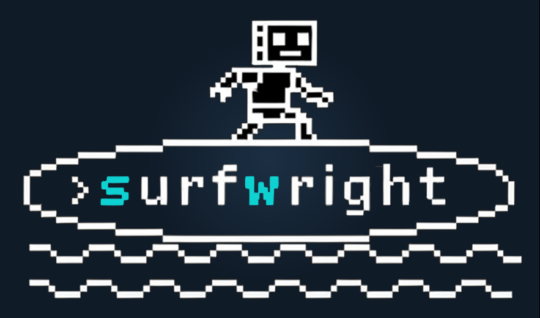

# SurfWright

<p align="left">
  <a href="https://github.com/marcohefti/surfwright/releases"></a>
  <a href="https://github.com/marcohefti/surfwright/actions/workflows/ci.yml"></a>
  <a href="https://www.npmjs.com/package/@marcohefti/surfwright"></a>
  <a href="https://www.npmjs.com/package/@marcohefti/surfwright"></a>
  <a href="#install"></a>
  <a href="LICENSE"></a>
</p>

<p align="left">
  
</p>

CLI-first browser control for agents:

- deterministic JSON output
- explicit handles (`sessionId`, `targetId`)
- typed failures (`code`, `message`, optional hints)

If you want the full machine contract, run:

```bash
surfwright contract
```

## Install

Recommended for agent workflows:

```bash
npx skills add marcohefti/surfwright
```

CLI install options:

```bash
npm i -g @marcohefti/surfwright
```

```bash
brew tap marcohefti/homebrew-tap && brew install surfwright
```

## 30-second flow

```bash
surfwright open https://example.com
surfwright target snapshot <targetId> --mode orient
surfwright target find <targetId> --text "Pricing" --first
surfwright target click <targetId> --text "Pricing" --proof
surfwright target read <targetId> --selector main --chunk-size 1200 --chunk 1
```

## Command groups

- `workspace.*`: project-local profile setup
- `session.*`: create/reuse/attach/clear sessions
- `extension.*`: register/reload/remove unpacked extensions
- `open`: navigate and return handles
- `target.*`: inspect, extract, click, fill, wait, download, network capture
- `run`: execute JSON plans
- `doctor`: runtime capability diagnostics
- `contract`: compact/full schema lookup

## Output and failure model

- JSON-first by default
- `--output-shape <full|compact|proof>` for smaller envelopes
- typed errors for deterministic recovery routing
- use `--no-json` only for human-readable output

Examples:

```bash
surfwright --output-shape compact open https://example.com
surfwright --output-shape proof target click <targetId> --text "Checkout" --proof
```

## Profiles and extensions (deterministic)

Use workspace profiles for persistent login state:

```bash
surfwright workspace init
surfwright open https://github.com/login --profile auth --browser-mode headed
surfwright open https://github.com --profile auth
```

Register unpacked extensions once; managed sessions apply the latest build automatically:

```bash
surfwright extension load ./dist/my-unpacked-extension
surfwright open https://example.com --profile auth
surfwright extension reload my-unpacked-extension
surfwright open https://example.com --profile auth
```

Runtime verification defaults to strict:

- `SURFWRIGHT_EXTENSION_RUNTIME_MODE=strict` (default): fail with `E_EXTENSION_RUNTIME_NOT_LOADED` when not observed
- `SURFWRIGHT_EXTENSION_RUNTIME_MODE=warn`: continue with `appliedExtensions[*].state` evidence
- `SURFWRIGHT_EXTENSION_RUNTIME_OBSERVED_WAIT_MS=<ms>`: observation window

For extension automation, prefer Chromium/CfT when stock Chrome blocks unpacked side-load flags:

```bash
surfwright --browser-executable /path/to/chrome-for-testing doctor
SURFWRIGHT_BROWSER_EXECUTABLE=/path/to/chrome-for-testing surfwright open https://example.com --profile auth
```

## Runtime/diagnostics essentials

```bash
surfwright doctor
surfwright contract --profile browser-core
surfwright contract --command "target click"
surfwright contract --commands open,target click,target read
```

Daemon control:

- `SURFWRIGHT_DAEMON=0`: force direct mode (no daemon)
- `SURFWRIGHT_DAEMON=1`: force daemon mode
- unset: daemon-on default

## Docs

- `ARCHITECTURE.md`
- `docs/architecture.md`
- `docs/release-governance.md`
- `docs/agent-guidance-architecture.md`
- `skills/surfwright/SKILL.md`

## Status

Pre-alpha. The surface is evolving quickly, but core handle-based flows are stable for daily agent loops.

## ZERO_CONTEXT_DAY

Declared: **February 13, 2026**

We celebrate this as the milestone where we found the testing path that became Zero Context Lab, and fresh agents, with near-zero guidance, successfully discovered and used SurfWright workflows on first try.

Zero Context Lab: https://github.com/marcohefti/zero-context-lab

```txt
  ┌─────────────────────────────────────────────┐
  │                                             │
  │   Z E R O   C O N T E X T   D A Y           │
  │                                             │
  │   the surface spoke for itself.             │
  │                                             │
  └─────────────────────────────────────────────┘
```
